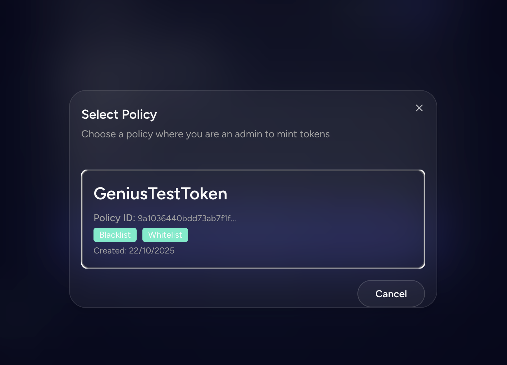

# CIP-113 Policy Manager - Quick Guide

## Introduction

CIP-113 is a Cardano Improvement Proposal that defines smart tokens with programmable transfer rules. This application allows you to create, mint, and manage CIP-113 compliant tokens with built-in access control mechanisms.

### Prerequisites

- **Wallet Connection**: Connect a Cardano wallet (Nami, Eternl, etc.)
- **Admin Rights**: You must be an admin to mint tokens for a policy
- **Network**: Currently running on Cardano Preview Testnet

---

## 1. Create Policy

Create a new CIP-113 policy that defines the rules and governance for your token.

### Form Fields

- **Token Name\*** (required): Name of your token (max 32 characters)
- **Admin Addresses**: Comma-separated list of additional admin addresses. Your wallet address is automatically included as admin
- **Enable Blacklist**: Restrict specific addresses from receiving/sending tokens
- **Enable Whitelist**: Allow only specific addresses to receive/send tokens


### Smart Contract Details

The policy creation deploys two Plutus V3 smart contracts:

1. **Rule Script** (Withdraw Validator): Enforces blacklist/whitelist rules and validates admin signatures
   - Parameterized with: blacklist linked list, whitelist linked list, admin public key hashes

2. **Smart Token Script** (Minting Policy): Controls token minting and transfer logic
   - Parameterized with: token name (hex), rule script policy hash

### Transaction Flow

1. User submits form with token configuration
2. System generates both validator scripts with parameters
3. Two stake credentials are registered on-chain (one for each script)
4. Transaction is signed by user's wallet and submitted
5. Policy ID is generated from the minting script hash

**Example Transaction:**

```
Transaction URL: https://preview.cexplorer.io/tx/dcacabe6e6b2b5dff1138a5b2ef21c79635ba5c0132a024fc9342efd22b4a3fb?tab=overview
```

---

## 2. Mint Tokens

Mint tokens under an existing policy with comprehensive metadata tracking. Only admin addresses can mint tokens.

### Form Fields

#### Basic Information

- **Selected Policy\*** (required): Choose from policies where you are an admin
- **Quantity\*** (required): Amount of tokens to mint (must be > 0)

#### Required Metadata

The following metadata fields are **required** to ensure proper token identification and compliance:

- **Asset Reference ID\*** (`asset_ref_id`):
  - **Format**: UUID v4 (e.g., `xxxxxxxx-xxxx-xxxx-xxxx-xxxxxxxxxxxx`)
  - **Purpose**: Stable series identifier for this RWA program; serves as a join key across on-chain and off-chain data
  - **Usage**: Correlates the token series with the off-chain evidence pack and public documentation
  - **Note**: Never changes for the life of the token series

- **Attestation SHA-256\*** (`attestation_sha256`):
  - **Format**: 64-character lowercase hexadecimal string (SHA-256 hash)
  - **Purpose**: Cryptographic proof that the published Asset↔Token Mapping document is exactly the one this token references
  - **How to Generate**:
    1. Finalize your Token-ownership-Mapping.pdf document
    2. Compute SHA-256 hash over the exact file bytes
    3. Use the resulting 64-hex string
  - **Verification**: This value must match the hash printed in your public "Proof of Ownership" document

#### Optional Metadata (Mapping Convenience Pointers)

These fields help verifiers easily locate and validate the mapping document:

- **Mapping CID** (`mapping.cid`):
  - **Format**: IPFS Content Identifier (CID)
  - **Purpose**: Points to where Token-ownership-Mapping.pdf is pinned on IPFS
  - **Example**: `QmX...abc123`

- **Mapping URL** (`mapping.url`):
  - **Format**: HTTPS URL
  - **Purpose**: HTTPS mirror of the Token-ownership-Mapping.pdf
  - **Example**: `https://example.com/docs/mapping.pdf`

- **Signature Type** (`mapping.signature.type`):
  - **Format**: String (e.g., `"pgp"` or `"cms"`)
  - **Purpose**: Indicates the type of detached signature for the mapping document

- **Signature CID** (`mapping.signature.cid`):
  - **Format**: IPFS CID
  - **Purpose**: Points to the detached signature file on IPFS
  - **Example**: CID for `Token-ownership-Mapping.pdf.asc`

#### Auto-Generated Metadata (Tokenomics)

The following fields are **automatically calculated** by the system:

- **Total Supply** (`total_supply`): Derived from the quantity field; represents total tokens created at mint
- **Decimals** (`decimals`): Fixed at `1` for UI/display precision (on-chain amounts are integers)
- **Admin PKH** (`admin_pkh`): Array of payment key hashes authorized for mint/burn and WL/BL operations (extracted from the policy)
- **Initial Allocations** (`initial_allocations`): Records who receives tokens at mint; totals equal `total_supply`
- **Minting Policy Hash** (`minting_policy_hash`): 56-character hex hash of the Smart Token Script used to mint this asset
- **Rule Script Policy Hash** (`rule_script_policy_hash`): 56-character hex hash of the Rule Script that enforces whitelist/blacklist and admin privileges
- **Unit** (`unit`): Unique on-chain ID in format `<policy_id>.<token_name_hex>` (e.g., `abc123....<4c55584f4646>`)





### Metadata Validation and Auditor Checks

When minting, the system ensures:

✓ **Ownership ID**: `unit` parses to the expected `policy_id` and `token_name`
✓ **Series Link**: `asset_ref_id` appears identically in mapping and Proof-of-Ownership docs
✓ **Rule Enforcement**: `rule_script_policy_hash` equals the deployed Rule Script
✓ **Document Integrity**: `attestation_sha256` matches the SHA-256 of the published Mapping.pdf
✓ **Supply Consistency**: `tokenomics.total_supply` equals the sum of `initial_allocations`
✓ **Minting Authority**: `minting_policy_hash` matches the minting script used for `unit`
✓ **Admin Authority**: `admin_pkh` matches the admin set enforced by the CIP-113 Rule Script

### Pre-Mint Checklist

Before minting, ensure you have:

1. ✅ Generated a unique `asset_ref_id` (UUID v4)
2. ✅ Finalized your Token-ownership-Mapping.pdf document
3. ✅ Computed the SHA-256 hash → set `attestation_sha256`
4. ✅ Confirmed the deployed Rule Script hash
5. ✅ (Optional) Uploaded mapping document to IPFS and/or HTTPS hosting
6. ✅ (Optional) Generated and uploaded detached signature file

### Smart Contract Details

The minting transaction interacts with both validators:

- **Minting Script**: Validates the minting redeemer and checks rule script validation
- **Rule Script**: Executed via withdrawal (0 ADA) to verify admin signature and enforce rules

Tokens are sent to a **smart receiver address** - a script address parameterized with the user's public key hash. This ensures CIP-113 compliance and enables programmable transfer logic.

All metadata is embedded in the transaction's metadata field (label 721 for CIP-25 compatibility), making it permanently available on-chain.

### Transaction Flow

1. User selects a policy and specifies quantity
2. User fills in required metadata fields (`asset_ref_id`, `attestation_sha256`)
3. User optionally adds mapping pointers (CID, URL, signature info)
4. System automatically calculates:
   - Smart receiver address for current user
   - Tokenomics fields (`total_supply`, `decimals`, `admin_pkh`, etc.)
   - Complete metadata structure
5. Transaction builds:
   - Minting output with specified quantity
   - Required signer: user's public key hash
   - Withdrawal from rule script (0 ADA) to trigger validation
   - Output sent to user's smart receiver address
   - Metadata attachment with all token information
6. Transaction is signed and submitted
7. Tokens appear in user's CIP-113 token balance with full metadata

### Post-Mint Actions

After successful minting:

1. **Publish Documentation**: Host your Token-ownership-Mapping.pdf (and detached signature if applicable)
2. **Publish Proof of Ownership**: Create and publish a document showing the same `asset_ref_id` and `attestation_sha256`
3. **Verify On-Chain**: Confirm all metadata appears correctly in the transaction metadata
4. **Update Records**: Keep track of your IPFS CIDs and URLs for future reference

**Example Transaction:**

```
Transaction URL: https://preview.cexplorer.io/tx/3dccad56b252499e4b9d0809f9d453cb13ffcd11dc6760d81fe0616e39ef7365?tab=overview
```

---

## 3. Transfer Tokens

Transfer CIP-113 tokens to another Cardano address.

### Form Fields

- **Recipient Address\*** (required): Destination Cardano address (addr1...)
- **Amount\*** (required): Quantity to transfer (must be ≤ available balance)

The modal automatically displays:

- Current token balance
- Token name and policy information
- Transfer summary with sender/recipient details


### Smart Contract Details

CIP-113 transfers involve spending from script addresses:

- **Smart Token Script**: Validates transfer redeemer and rule compliance
- **Rule Script**: Verifies sender signature and checks blacklist/whitelist rules

Both the sender and recipient use **smart receiver addresses** parameterized with their respective public key hashes.

### Transaction Flow

1. User specifies recipient address and amount
2. System selects appropriate UTxO containing tokens
3. System calculates:
   - Recipient's smart receiver address
   - Change amount (if not transferring full balance)
4. Transaction builds:
   - Spending input: UTxO from sender's smart receiver address
   - Output 1: Tokens to recipient's smart receiver address
   - Output 2 (if change): Remaining tokens back to sender's smart receiver address
   - Withdrawals from both smart token and rule scripts (0 ADA each)
   - Required signer: sender's public key hash
5. Transaction is signed and submitted
6. Tokens are transferred to recipient's CIP-113 address

**Example Transaction:**

```
Transaction URL: https://preview.cexplorer.io/tx/418731ff5e281ce158991cd47cf607bbf35ce15d92962a4750ac43d91f6b13b2?tab=overview
```

---

## 4. Burn Tokens

Permanently destroy CIP-113 tokens. **Only policy administrators can burn tokens.**

### Form Fields

- **Amount\*** (required): Quantity to burn (must be > 0 and ≤ available balance)

The modal automatically displays:

- Current token balance
- Token name and policy information
- Warning message about irreversible action
- Admin-only operation notice


### Access Control

**Important**: The burn operation is restricted to policy administrators only.

- The burn button is **disabled** for non-admin users
- Only addresses listed in the policy's `adminAddresses` can execute burns
- This ensures controlled token supply management

### Smart Contract Details

Token burning is implemented as negative minting:

- **Smart Token Script**: Validates burn redeemer (`ConStr0(["burn"])`) and rule compliance
- **Rule Script**: Verifies admin signature and enforces governance rules
- **Minting Amount**: Negative value (e.g., `-100` to burn 100 tokens)

The transaction spends UTxOs from the admin's smart receiver address and burns the specified amount.

### Transaction Flow

1. Admin user specifies amount to burn
2. System validates user is in policy's admin list
3. System selects appropriate UTxO(s) containing tokens
4. Transaction builds:
   - Spending input: UTxO(s) from admin's smart receiver address
   - Negative mint: Burns specified token quantity
   - Change output (if applicable): Remaining tokens back to admin's smart receiver address
   - Withdrawals from both smart token and rule scripts (0 ADA each)
   - Required signer: admin's public key hash
5. Transaction is signed and submitted
6. Tokens are permanently removed from circulation

**Example Transaction:**

```
Transaction URL: https://preview.cexplorer.io/tx/95921989c3255ed28698f6dcc6ef27f5dee448bce714f9ee98c373ca181bce29
```

### Important Notes

- **Irreversible**: Burned tokens cannot be recovered
- **Admin Only**: Only policy admins can execute burn transactions
- **Supply Reduction**: Burning permanently reduces total token supply
- **Change Handling**: If burning partial balance, change is returned to admin's smart receiver address

---

## Technical Notes

- **Script Addresses**: All CIP-113 tokens are held in script addresses (smart receiver addresses), not regular wallet addresses
- **Collateral**: Transactions involving smart contracts require collateral UTxOs
- **Plutus Version**: All scripts are Plutus V3
- **Redeemers**:
  - Minting uses `ConStr0(["mesh"])`
  - Burning uses `ConStr0(["burn"])`
  - Transfers use `ConStr0([])` for token script and `ConStr1([[signerHash], [0], [0]])` for rule validation
  - Spending from smart addresses uses `ConStr0([])`
